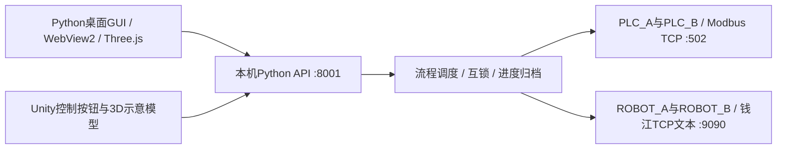

# 船舶结构件焊接：PLC Modbus TCP、钱江机器人 TCP 与 Python / Unity 桥接

记录日期：2026-10-09。本文记录船舶结构件焊接工位的控制与监控联调：三台龙门、机械臂地轨、两台钱江机械臂，按拼板、装筋、隔板焊接三个阶段组织流程。

已完成协议读取、指令绑定、Python控制服务、桌面GUI及Unity桥接；不代表全部工况的焊接质量、整线连续运行性能或安全认证已验证。设备IP、账户与私人主机地址不公开，以下使用逻辑名称。

## 1. 架构：界面共用一个控制服务



| 逻辑设备 | 现场职责 | 已确认的连接方式 |
| --- | --- | --- |
| PLC_A | 龙门1、龙门3 | Modbus TCP，端口502；本项目线圈操作使用device_id=20 |
| PLC_B | 龙门2、机械臂地轨 | Modbus TCP，端口502；线圈ID20、位置保持寄存器ID1 |
| ROBOT_A | 机械臂1；项目API别名R151 | 钱江TCP文本协议，现场端口9090 |
| ROBOT_B | 机械臂2；项目API别名R152 | 钱江TCP文本协议，现场端口9090；独立保存任务状态 |

同样是TCP端口，不代表协议相同。现场机器人9090返回`@A...&`等文本；不能仅因为它使用网口，就拿Modbus客户端连接9090。这里的端口、ID、M/D映射及完成信号都是现场配置，不是所有PLC或钱江机器人的出厂默认值。

## 2. Python连接PLC：先只读，再授权写入

本项目锁定`pymodbus==3.11.1`，使用该版本的`device_id`参数；不要直接套用其他版本示例里的`slave`/`unit`关键字。API签名以[PyModbus 3.11.1官方文档](https://pymodbus.readthedocs.io/en/v3.11.1/source/client.html)为准。

M位在现场映射成线圈，以FC01读取、FC05写入；D位置数据通过FC03读取保持寄存器。软件地址、PLC符号与Unit ID必须对照实际PLC映射表确认，不能把`M900`与线圈900的对应关系当成通用标准。

只读示例，不会发送动作：

```python
import os
from pymodbus.client import ModbusTcpClient

client = ModbusTcpClient(
    os.environ["PLC_A_HOST"], port=502, timeout=3, retries=0
)
try:
    if not client.connect():
        raise ConnectionError("PLC TCP连接失败")
    result = client.read_coils(620, count=5, device_id=20)
    if result.isError() or len(result.bits) < 5:
        raise RuntimeError(f"PLC读取异常: {result}")
    print({"M620": result.bits[0], "M622": result.bits[2],
           "M624": result.bits[4]})
finally:
    client.close()
```

已授权、现场停稳且应用互锁允许时，写指令的调用形式为`client.write_coil(address, True, device_id=20)`。写入响应正常只说明PLC确认了请求，不说明动作已开始、已到位或已焊接完成。写超时也不等于指令没被接收，不能自动重发运动指令。

项目对部分只读超时允许重试一次，运动写入设置`retries=0`，结果不确定时保留动作锁。不同PLC并发读取或明确授权的准备动作使用独立客户端；不跨线程共享同一个同步客户端。[PyModbus官方说明](https://pymodbus.readthedocs.io/en/v3.11.1/source/client.html#client-usage)也要求应用处理客户端线程安全。

### 保持寄存器：低字在前的有符号32位

```python
def decode_signed32_low_high(words):
    if len(words) != 2:
        raise ValueError("需要两个16位寄存器")
    low, high = words
    unsigned = (high << 16) | low
    return unsigned - (1 << 32) if unsigned & (1 << 31) else unsigned

# PLC_B：read_holding_registers(8144, count=2, device_id=1)
# PLC_A：read_holding_registers(8370, count=2, device_id=1)
```

现场D8144/D8145为地轨反馈，D8370/D8371用于第三阶段的一项位置条件。二者按低字在前、signed32处理。曾读取`[23530, 65535]`，正确结果为`-42006`；忽略符号位会误判成巨大正数。

原始反馈值的物理单位未完整确认，不能直接标成毫米或米。图中的0–9m模型区间也不能代替实际位置反馈。此前尝试的8420没有体现移动变化，最终使用的是8144；不要仅根据“寄存器能读出数字”认定它就是位置。

## 3. 钱江机器人：原始TCP文本与状态判定

现场依据《钱江机器人远程通讯手册-4.0.2》中的远程TCP章节，采用Python `socket`、ASCII发送及响应帧解析。实际服务绑定设备网卡或使用系统路由，不经过Unity直接写设备。

| TCP命令 | 含义 / 处理要点 |
| --- | --- |
| `@A&` | 读取状态；解析模式、运动状态、伺服、程序运行、急停等字段 |
| `@L程序名&` | 加载示教器已有程序；现场调用去掉`.rbg`后缀，加载成功响应1029 |
| `@Z1&` | 启动程序；启动响应与任务完成是两件事 |
| `@Z2&` | 暂停程序；应用“暂停流程”按钮另有语义，见后文 |
| `@Z3&` | 停止程序；现场停止响应包含1047，仍需读取停止状态 |
| `@X2VA001&` | 读取VA1；可能返回裸数字，不能只按带`&`的帧解析 |
| `@BDO32&` | 读取DO32；现场响应`@B0&`或`@B1&` |
| `@C&` | 读取关节与笛卡尔坐标；现场返回`JointPosition:...CartesianCoordinates:...` |
| `@Y0&` | 去伺服使能 |
| `@Y1&` | 上伺服使能；本项目解除停机时不自动发送 |
| `@Y2&` | 清报警；硬件急停仍触发时不能用它解除硬件急停 |

只读`@A&`示例，其他帧类型需按实际协议另行解析：

```python
import os
import re
import socket
import time

with socket.create_connection((os.environ["ROBOT_A_HOST"], 9090), 2) as sock:
    sock.settimeout(2)
    sock.sendall(b"@A&")
    buffer = b""
    deadline = time.monotonic() + 4
    status = None
    while time.monotonic() < deadline:
        chunk = sock.recv(2048)
        if not chunk:
            break
        buffer += chunk
        while b"&" in buffer:
            raw, buffer = buffer.split(b"&", 1)
            raw = raw.decode("ascii") + "&"
            if re.fullmatch(r"@A[1-4][1-4][01][01].*&", raw):
                status = raw
                break
        if status is not None:
            break
    if status is None:
        raise TimeoutError("未收到匹配的机器人状态帧")
    print({"mode": int(status[2]), "motion": int(status[3]),
           "servo": status[4] == "1", "running": status[5] == "1",
           "estop": status[14] == "1"})
```

TCP会拆包、粘包，不能把一次`recv()`等同于一条完整响应。状态帧和`@Acode=...&`命令响应也不能混淆；坐标、VA裸数字不能强行套用状态帧解析器。生产代码还应检查帧长度、连接中断和匹配截止时间。

模式字段4表示远程；运动状态1/2/3/4分别为运行/停止/报警/暂停。启动检查还涉及伺服、急停和运行标志。现场曾见状态码1011：即便界面模式为远程，也需检查示教器远程控制来源是否允许TCP控制，不能只改错误提示后重试。已实现的启动检查要求伺服已开启；若某台控制器使用“远程启动自动使能”，需按该控制器配置单独确认策略，不能假定所有设备相同。

### DO32完成信号：现场程序约定，不是厂家通用定义

本项目约定：**DO32=1运动中，DO32=0表示当前任务完成**。两台机械臂分别记录自己的程序、启动时间和DO32，不共用上一台机械臂的缓存。

启动确认后等待至少15秒，再持续读取本机DO32；读到0后，还要确认机器人停止、程序不再运行且无急停。若结束时示教器仍是暂停/程序运行位1，项目会停止已完成的程序，再读取状态确认停稳，之后才放行下一设备。

VA1由现场后台脚本维护，1为工作中、0为停止。它保留为状态对照和部分就绪检查，不能单独代替任务成功完成。程序结束、暂停、异常停止可能都表现为“不动”；同样，DO32的可靠性依赖机器人程序维护约定，固定等待15秒不能替代程序正确设置完成标志。

## 4. 船舶焊接三阶段与反馈门槛

| 阶段 | 工位与主要动作 | 关键等待 / 完成策略 |
| --- | --- | --- |
| Stage1 | 拼板；地轨位置1、机械臂拼板程序、龙门1两条焊接 | 地轨反馈349500–350500；机械臂DO32；PLC_A M622/624/626 |
| Stage2 | 装筋；地轨位置2、移开龙门1、压筋、多头焊、高筋焊 | 地轨2045000–2046500并且PLC_A M623=True；PLC_B六个完成位及机械臂DO32 |
| Stage3 | 隔板焊接；两台机械臂交替运行、龙门3动作、末尾复原 | 地轨3157700–3158000且PLC_B M607=True；PLC_A D8370≤-42000；各机械臂DO32；末尾动作人工确认 |

当前阶段分别定义12、19、15步，Stage4未定义。第三阶段第15步是确认工作动作完成后追加的三台龙门复位，不是把复位结果当作已经验证的到位反馈。

Stage1真实启动前，必须重新读取以下12个位且全部为True；任一False或读取失败，提示先复原再检测，禁止发送第1步动作，不自动发送复原指令：

- PLC_A：M622、M624、M626、M616、M620。
- PLC_B：M606、M600、M602、M604、M610、M612、M615。

这些条件是在机器人、位置和急停就绪检查之前进行的启动门槛。通过它们仍不等于整线已经完成所有安全检查。

第2阶段的准备动作在明确指定下允许地轨与龙门的两个PLC请求并发，第2步的两个反馈也并发读取；这不是放开机械臂与龙门的互锁，更不保证设备动作在物理时钟上精确同步。

PLC完成位等待常采用先等10秒再读取；第三阶段D8370先等15秒，再持续等到≤-42000。等待期间可停止流程；不能以计时结束、PLC写入确认或沿用上次True缓存替代新动作的完成证据。

## 5. 流程、暂停、清空与单设备模式

| 功能 | 项目实现 |
| --- | --- |
| 完整播放 | 按阶段顺序执行，遇到未满足反馈或异常不发下一动作 |
| 暂停 / 继续 | 暂停后续运动指令，已发动作的反馈检测继续；不是立即停止设备 |
| 停止本轮 | 取消后续步骤并请求PLC停机及机械臂停止/去使能，结果待确认时保留锁 |
| 逐步执行 / 重复 | 可单步、重查、重复已完成步骤；重复归档旧记录并重置后续进度；不能重发未确认结束的动作 |
| 清空Stage1–3 | 归档三个阶段状态，只清软件进度，不复位设备、不写PLC完成位；动作或急停锁未解除时拒绝清空 |
| 重启 | 读取持久进度与互锁，标记中断，不自动重发动作或继续流程 |
| 单设备控制 | 选择一个目标；其他设备需现场停稳，离线机械臂已断电/禁能并隔离后明确确认；一次一个动作 |

单设备模式解决“无关设备离线导致所有手动按钮不可用”，但不会把离线视为停止。联网机械臂仍校验停稳，目标PLC必须确认M900已解除，完整流程和未确认动作不能被绕过。单设备动作未结束时阻止下一条；服务重启后隔离确认失效，需要重新现场确认。

Stage3末尾PLC动作没有提供完整的自动完成反馈，所以保留“确认Stage3完成”的检查点；确认后自动发龙门1 M200、龙门2 M30初始化、龙门3 M300。复位指令后仍保留锁，待现场确认回原位。程序被中止或服务重启时不会自动复位。

## 6. 软件停机与硬件急停的区别

统一软件停机按钮向两PLC写M900=True，同时对两机械臂执行`@Z3&`停止和`@Y0&`去使能，再读取状态。任一失败分别显示结果并保留停机锁。

解除时先向两机械臂`@Y2&`清报警，确认无硬件急停且停止，再向两PLC写M900=False并回读；失败时保留锁，PLC解除失败会重新请求全线停机。解除不自动上伺服，也不自动启动程序，必要时仍需现场使能。

TCP手册中的停止、去使能和清报警不能描述成安全等级的硬件急停。硬件急停必须现场解除；应用互锁也不能代替PLC、机器人控制器与现场安全回路中的互锁。

## 7. Python API：Unity与GUI共用

| 接口 | 作用 |
| --- | --- |
| `POST /api/phases/stage1/play` | 拼板阶段从头完整播放 |
| `POST /api/phases/stage2/play` | 装筋阶段从头完整播放 |
| `POST /api/phases/stage3/play` | 隔板阶段从头完整播放 |
| `GET /api/phases/status` | 当前阶段、步骤、phase、message及暂停状态 |
| `POST /api/workflow/pause` / `resume` | 暂停后续动作 / 继续 |
| `POST /api/workflow/stop` | 停止本轮 |
| `POST /api/workflow/reset-all` | 清空三个阶段的软件进度 |
| `POST /api/workflow/acknowledge-stopped` | 现场停稳确认；Stage3特定完成检查点会触发后续三台复位 |
| `/api/standalone/...` | 单设备配置、控制、完成确认与退出 |
| `POST /api/plc/emergency-stop` / `emergency-release` | 保留历史接口名，实际已包含两PLC和两机械臂 |

播放请求体：`{"request_id":"客户端生成的唯一UUID","mode":"live"}`；`mode="demo"`为演示。Unity通过`UnityWebRequest`调用，而不是直接向PLC或机器人发指令。

相同request_id不会重放动作；网络超时后先读取状态，不自动生成新ID再次发送。HTTP成功或accepted只说明请求被接受，必须继续看phase和message：启动前检测也可能在接收请求后阻止执行。

进度、互锁和历史放在Windows `%LOCALAPPDATA%/YaoGantryController/data`。它们用于恢复操作上下文与防重发，不是设备实时状态缓存；确认动作必须重新读取反馈。

## 8. Windows GUI EXE与Unity随包部署

Python桌面入口`YaoGantryDesktop.exe`内置Vite生产版Three.js页面。Windows使用pywebview的WebView2/Edge Chromium内核，而不是macOS的WebKit；目标电脑需要相应WebView2 Runtime，参见[pywebview官方说明](https://pywebview.flowrl.com/guide/web_engine)。

- GUI页面为本机`127.0.0.1:5179`；API为`127.0.0.1:8001`，设备请求由本机服务发出，不依赖原开发电脑。
- EXE的`--server`参数只运行服务；已有兼容服务时GUI复用它，不再开第二个设备控制器。
- 采用PyInstaller目录式打包，必须保留`_internal`，不能只复制EXE。
- 关闭GUI或退出Unity界面不会自动结束独立控制服务；关闭界面不是停止设备的方法。
- 两种界面可以同时观察状态，但真实设备应只有一个共享控制服务。切换控制电脑前先结束旧端流程并确认停稳。

Unity使用2021.3.1f1c1。`PythonBridgeDemo`是早期按钮/API验证项目；`GantryDesktopViewer`增加原生轨道、龙门及两机械臂3D示意模型。它们是两个项目，不是两个Unity版本。

两个项目都将同一新版EXE与运行库放入`Assets/StreamingAssets/ControlService`，播放器构建时随包复制；用`Application.streamingAssetsPath`定位，参见[Unity 2021.3 StreamingAssets文档](https://docs.unity3d.com/2021.3/Documentation/Manual/StreamingAssets.html)。`BundledControlService`启动`YaoGantryDesktop.exe --server`，已有服务时复用。三个阶段、完成位门槛、清空和Stage3复位逻辑都在Python服务中，不应在两个Unity项目各自复制一套调度逻辑。

Unity已验证脚本编译、场景生成与API连接；3D模型轴向、零位和尺寸尚未校准，龙门位置仍为示意/指令估算。读取真实J1–J6不等于已实现精确数字孪生或碰撞检测。

## 9. 网络和典型故障

控制电脑可同时使用办公/无线网络与设备有线网卡。设备网络配置到本机网卡，Python的`source_address`或`socket.bind()`只能绑定本机已有地址，不能绑定设备地址；路由也要指向正确网卡。

Windows项目支持`equipment_source_ip` / `GANTRY_TYPEC_IP`，默认`0.0.0.0`交由系统路由选源地址；这不意味着已经绑定指定USB网卡。更换Type-C网卡、网段或控制电脑后，检查本机地址及路由，不复制另一台电脑的源IP。`Get-NetIPAddress`、`route print`与TCP端口检查比只看ping更有针对性。

| 现象 | 本案例的检查方向 |
| --- | --- |
| Cannot assign requested address | 绑定的源地址不属于当前电脑；检查网卡是否拔除、IP是否改变 |
| Connection refused | 检查目标IP、监听端口与TCP服务；拒绝连接不等于Modbus地址错误 |
| timed out / No response after 0 retries | 逐层检查网卡、路由、端口、协议、Unit ID及寄存器映射；不据此自动重发动作 |
| PLC可通，机器人9090不可通 | GUI/API正常不等于设备全部在线；分别检查机器人服务及网络 |
| 程序可加载但不能启动 | 看状态码、伺服、急停、程序运行和控制来源配置；不能只检查模式4 |
| 阶段结束后下一个按钮不能用 | 查看末尾动作是否仍待确认、急停锁、流程锁或单设备busy；不要用清空绕过 |
| 显示True但流程卡住 | 确认是本次实时读数，所有指定条件均满足；暂停、程序运行位和完成标志要分开看 |

包内源码修改要显式使用UTF-8或按原始字节传输。现场曾因PowerShell默认编码重写含中文的Python文件导致语法错误；PyInstaller输出EXE并不能证明关键模块可导入。打包前做import/语法检查，打包后验证health、状态接口和GUI静态页面，不用真实动作当启动测试。

## 10. 验证范围与来源

已验证：现场PLC只读线圈/位置反馈、钱江TCP状态与关节读取、部分程序与动作绑定；Python模拟测试覆盖顺序执行、启动门槛、互锁、暂停/继续、进度归档、软件停机及解除条件；WindowsEXE启动、GUI渲染和Unity编译/桥接也已验证。单次读数不代表现在仍保持该值，模拟测试不代表全部真实焊接工况已通过。

待补充：完整现场地址映射表的脱敏版本、位置物理单位、机器人程序DO32维护规范、末尾动作/复位的自动到位信号、几何与关节标定，以及整线焊接质量与持续运行验证记录。

来源：现场提供的《钱江机器人远程通讯手册-4.0.2》（远程TCP章节1.2.1–1.2.5、IO及坐标读取相关章节），项目代码和联调记录，以及上文链接的PyModbus、pywebview与Unity官方资料。本文不上传原手册、现场地址、账号或未脱敏日志。

相关笔记：[伟景智能Vizum：高级管理模式与帧率、点云调优](../industrial-vision/vizum-advanced-mode-tuning.md)。工业视觉参数调优与设备运动控制应分别验证，点云更多不代表焊接路径或避碰已经正确。
